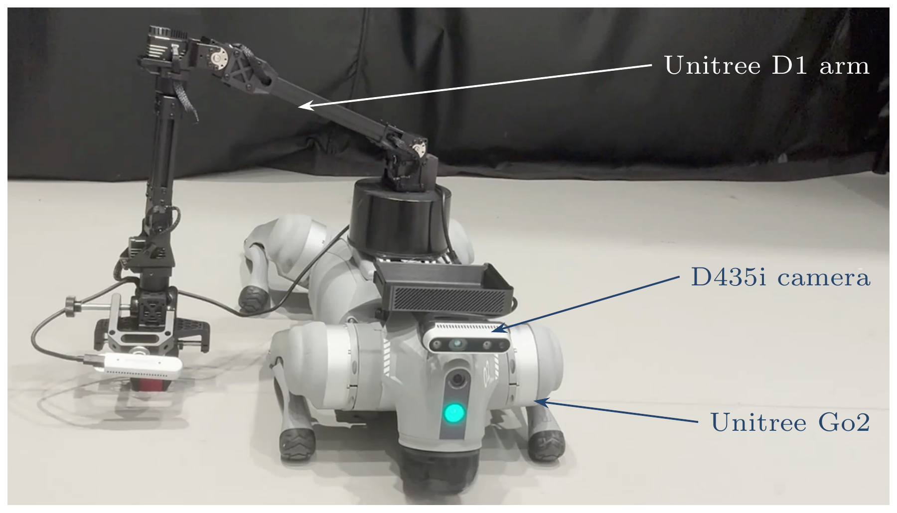

# Self Improvement Learning

**Your first goal:** install the workstation software, complete a pretend-hardware check, and retrieve a camera image from a Unitree Go2. A supervised movement test comes after those checks.

<figure class="handbook-figure" markdown="1">

<figcaption markdown="1">

Self Improvement Learning platform with a D1 arm and D435i camera. The first navigation steps do not use arm control.

[View full-size image](assets/platform.png) · [Source PDF](assets/platform.pdf)
{ .figure-links }

</figcaption>

</figure>

The system has **two computers**:

| Computer | Job |
|---|---|
| Shared Linux GPU workstation | Runs the model and sends requests; also serves VLA Pipeline |
| Robot's onboard computer | Reads the camera and runs robot-control skills |

The **bridge** is the small program that passes images and commands between the two computers. A **skill** is a supported action such as moving a short distance or turning.

## Setup guide

First complete [Before you begin](../getting-started/index.md) and [computer preparation](../getting-started/computer.md).

| Step | Guide | You are finished when… |
|---|---|---|
| 1 | [Hardware and connections](hardware.md) | Robot equipment and shared workstation access are ready |
| 2 | [Install the software](setup.md) | The mock bridge returns a saved image |
| 3 | [Connect the robot](robot-bridge.md) | You can retrieve a live camera image |
| 4 | [First supervised movement](first-run.md) | The dog completes one short command and the session ends |

Model installation is [optional](models.md); it is not required for these four steps. **D1 arm commissioning is pending**—see the [D1 readiness checklist](d1-arm.md) before planning manipulation.

After setup, use the [quick reference](quick-reference.md). The remaining pages describe advanced experiments: [offline model evaluation](vla-eval.md), [voice and benchmarks](operator-cookbook.md), and the [legacy rollout](rollout.md). They are not the initial installation path.

## What is required beyond this repository?

`unidog_nav` is the workstation project. The robot also needs the lab's **`LLM_guided_RL`** skill executor, its hardware environment, and a commissioned robot with a working stop procedure. The photographed platform includes a D1 arm. Manipulation requires additional calibration and services and is outside the first walking setup.

The inspected preflight expects a robot checkout on branch `offline-rl-vlm-policy`. The workstation copy of the companion repository and its current README are not proof that an arbitrary new robot image is ready. See [source handoff and remaining gaps](../getting-started/sources.md).
