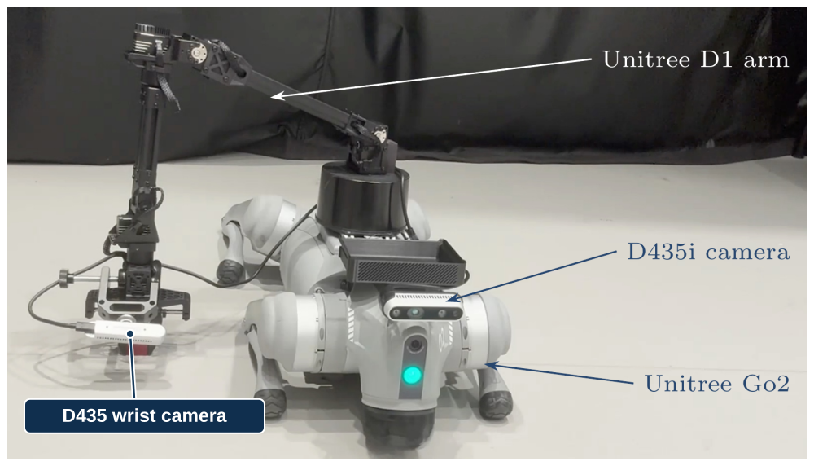

# Self Improvement Learning

A mobile platform built around **one [Unitree Go2](https://www.unitree.com/go2/)**, **one [Unitree D1 arm](https://www.usrobotstore.com/products/unitree-go2-servo-robotic-arm-d1)**, a front **[RealSense D435i camera](https://www.realsenseai.com/products/depth-camera-d435i/)**, a **[D435 wrist camera](https://www.realsenseai.com/products/stereo-depth-camera-d435/)**, and an onboard computer.

**Your goal:** identify the delivered equipment, confirm the mounting and connections, and arrange separate readiness checks for the dog and arm.

<figure class="handbook-figure" markdown="1">

<figcaption markdown="1">

The picture shows **1 Go2**, **1 D1 arm**, the labeled front **D435i**, and **1 D435 wrist camera beside the gripper**. The arm requires its own mounting and calibration checks.

[View full-size image](assets/platform-labeled.svg) · [Source PDF](assets/platform.pdf)
{ .figure-links }

</figcaption>

</figure>

## Which computer goes where?

| Computer | Physical role |
|---|---|
| Shared workstation | Stays at the desk and connects to the robot over the lab's approved network |
| Onboard computer | Rides on the robot and connects to its camera and control interfaces |

## Set up the platform

| Step | Guide | Ready when… |
|---|---|---|
| 1 | [Equipment and connections](hardware.md) | Robot, battery, controller, camera, onboard computer, and arm equipment are accounted for |
| 2 | [D1 arm readiness](d1-arm.md) | The mounting, cable routing, calibration, and stop procedure are approved |
| 3 | [Hardware readiness](readiness.md) | An operator has checked the complete platform and recorded any outstanding work |

The detailed D1 mounting and commissioning procedure must still be supplied for this platform. Completing checks on the dog does not establish that the arm is ready.
