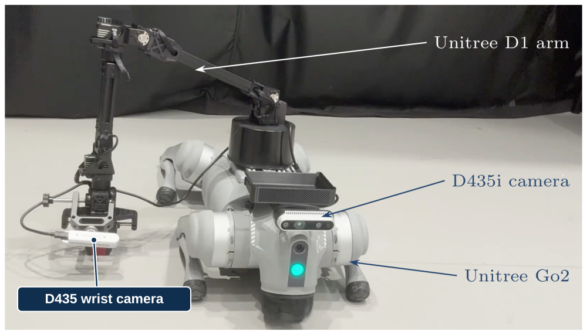

# Self Improvement Learning

A mobile platform built around **one [Unitree Go2 EDU Plus](https://www.unitree.com/go2/)** with its onboard computer, **one [Unitree D1 arm](https://www.usrobotstore.com/products/unitree-go2-servo-robotic-arm-d1)**, a front **[RealSense D435i](https://www.realsenseai.com/products/depth-camera-d435i/)**, and a **[D435 wrist camera](https://www.realsenseai.com/products/stereo-depth-camera-d435/)** on the arm. The [shared workstation](../getting-started/hardware.md) stays at the desk and talks to the robot over the lab network.

**Your goal:** identify the delivered equipment, mount and connect the arm and cameras, and arrange separate readiness checks for the dog and the arm.

!!! info "What you need"
    **Core equipment:** Go2 EDU Plus with battery, charger, and controller · D1 arm with mounting kit · protective gantry · D435i front camera · D435 wrist camera with clamp mount.

    **Open items:** wrist-camera USB host and cable route, gantry clearance with the arm mounted, calibration target. [Details](../getting-started/sources.md#open-items)

<figure class="handbook-figure" markdown="1">

<figcaption markdown="1">

Unitree Go2 · Unitree D1 arm on the expansion dock · D435i in a printed bracket on the head · D435 wrist camera clamped beside the gripper. The gantry is not shown.

[View full-size image](assets/platform-labeled.svg) · [Source PDF](assets/platform.pdf)
{ .figure-links }

</figcaption>

</figure>

## Set up the platform

| Step | Guide | Ready when |
|---|---|---|
| 1 | [Equipment and connections](hardware.md) | Robot, battery, controller, cameras, and arm equipment are accounted for and connected |
| 2 | [Mount and check the D1 arm](d1-arm.md) | The arm mounting, cable routing, calibration, and stop procedure are approved |
| 3 | [Hardware readiness](readiness.md) | An operator has checked the complete platform |

A ready dog does not make the arm ready: complete the D1 checks separately.
