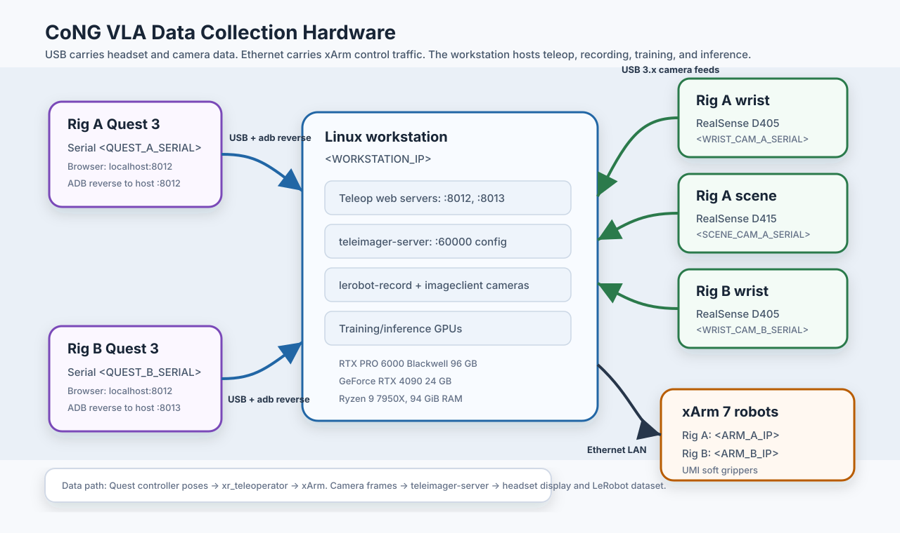

# Hardware

This page documents the physical VLA data-collection station: two UFACTORY xArm 7, two Meta Quest 3, three RealSense cameras, and the Linux workstation that runs teleoperation, recording, training, and inference.

## System architecture

<!-- The editable source for this diagram is [hardware_architecture.drawio](../assets/hardware_architecture.drawio). -->

## Bill of materials

| Group | Component | Qty | Purchase / spec link |
|---|---|---:|---|
| Robot | UFACTORY xArm 7 + AC control box | 2 | [UFACTORY xArm 7](https://www.ufactory.us/product/ufactory-xarm-7) |
| End effector 1| xarm gripper base | 2 | [xarm gripper base](https://www.ufactory.us/product/ufactory-xarm-gripper) |
| End effector 2| xarm gripper mount (todo) | 2 | [gripper mount]() |
| End effector 3| UMI soft gripper (todo) | 2 | [UMI GitHub hardware/software](https://docs.google.com/document/d/1TPYwV9sNVPAi0ZlAupDMkXZ4CA1hsZx7YDMSmcEy6EU/edit?tab=t.0) |
| End effector 4| gripper tape (buy) | 2 | [3M Gripping Material TB641](https://a.co/d/03Mhlm75) |
| VR teleop | Meta Quest 3 512 GB | 2 | [Meta Quest 3](https://www.meta.com/quest/quest-3/) |
| Wrist camera | RealSense D405 | 2 | [RealSense D405](https://store.realsenseai.com/buy-intel-realsense-depth-camera-d405.html) |
| Scene camera | RealSense D415 (buy) | 2 | [RealSense D415](https://store.realsenseai.com/buy-intel-realsense-depth-camera-d415.html) |
| Workstation | Linux workstation + NVIDIA GeForce RTX 4090 24 GB | 2 | [RTX 4090](https://www.nvidia.com/en-us/geforce/graphics-cards/40-series/rtx-4090/) |
| Robot Stand | (todo) | 2 | [3M Gripping Material TB641](https://a.co/d/03Mhlm75) |
| Robot Mount | (todo) | 2 | [3M Gripping Material TB641](https://a.co/d/03Mhlm75) |
| Network | router | 1 | [TP-Link TL-SG105](https://www.tp-link.com/us/business-networking/unmanaged-switch/tl-sg105/) |
| Camera mounting | ULANZI / JUSMO camera desk mount stand | 2 | [Amazon product page](https://a.co/d/0fDvzJxx) |
| Screws |  | 2 | [Amazon product page](https://a.co/d/0fDvzJxx) |

## Assembly and networking

Below is a suggested workflow:

1. **Robot arms**
    - Build the Vention robot stand
    - Mount the robot
    - Install the gripper
    - Connect the arm control boxes to the router and set **static IP addresses**
2. **Meta Quest**
    - Connect the headset and enable developer mode
    - **Record the serial number**
    - Set up `adb reverse` port forwarding
3. **Cameras**
    - Mount the scene/wrist cameras (camera mount for scene cameras)
    - Record the **serial numbers**

Once the station is assembled and on the network, continue to
[Teleoperation → Setup](../teleop/setup.md#configuration-one-time-after-assembly) to
write the arm/Quest/camera identities into the software and launch a session.

