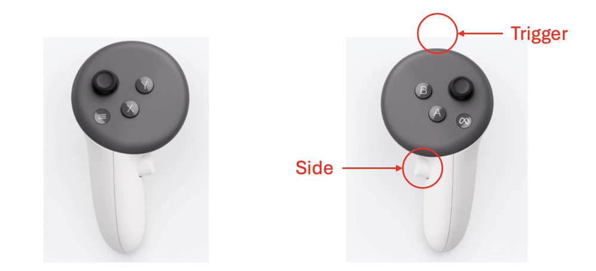

# VLA Pipeline hardware

**Goal:** identify and connect the two-arm VLA Pipeline station. It has **two xArm 7 robots**, each with its own control box, gripper, and mounting stand. Both use the workstation shared with Self Improvement Learning and ABC Box. Check rig A first, then rig B, before using both together.

<figure class="handbook-figure" markdown="1">

{ loading=lazy width=1000 height=750 }

<figcaption markdown="1">

Both xArm robots · Foreground gripper · Three D435 scene cameras · Task tray · Two D405 wrist cameras (one per arm).

Lab photograph provided in September 2026. Labels identify visible parts, not rig A/B assignments.

[View full-size image](../assets/xarm-station-labeled.svg) · [Source photograph](../assets/xarm-station.jpg) · [Earlier labeled view](../assets/system_overview-labeled.svg)
{ .figure-links }

</figcaption>

</figure>

## 1. Gather the equipment

Quantities below describe the **two-arm lab station**. The [shared workstation, GPU, display/input devices, and network equipment](../../getting-started/hardware.md#shared-equipment-prepare-once) are shared by all three projects and counted once. The list allows one headset and two controllers per rig. Confirm the number of operators and headsets to use in the first session with the project owner.

| Equipment | Quantity |
|---|---|
| UFACTORY xArm 7 robot | 2 |
| Matching control box and cable/power set | 2 sets |
| Compatible xArm gripper and mounting/cable set | 2 sets |
| Rigid arm mount or stand | 2 |
| Shared work table | 1 |
| Meta Quest 3 headset | 2 |
| Quest controller | 4 |
| Headset USB data cable | 2 |
| RealSense D405 wrist camera, bracket, and USB cable | 2 sets |
| RealSense D435 scene camera, stand, and USB cable | 3 sets |
| Arm-controller-to-switch Ethernet cable | 2 |
| Task objects and tray/basket | 1 task set |
| Cable labels, cable management, and suitable lighting | As needed |

### Photo count check

The current photo shows **2 arms, 2 wrist cameras, and 3 scene cameras**: **5 cameras total**, matching the list. The earlier view also shows **2 grippers, 2 arm stands, 2 control boxes with stop buttons, and 2 headsets**. The controller illustration shows one pair; it does not verify the listed four controllers. Confirm loose cables and accessories against the station inventory.

### Selection details

- **Arms and controllers:** match the lab's [xArm 7](https://help.ufactory.cc/en/articles/4491842-the-difference-between-ufactory-xarm5-ufactory-xarm6-and-ufactory-xarm7). Confirm included power supplies, mains leads, and arm/controller cables against [UFACTORY's installation guide](https://docs.xarm.ufactory.cc/2.hardware_installation.html).
- **Grippers and stands:** obtain the approved finger geometry, adapters, calibration, base plates, and fasteners from the owner. Exact custom part numbers and the stand bill of materials remain to be specified.
- **Headsets:** include [Quest 3](https://www.meta.com/quest/quest-3/) chargers, controller batteries, and data-capable USB cables long enough for the operator.
- **Cameras:** use one [D405](https://www.realsenseai.com/product-family/d405-series/) per wrist and three [D435 scene cameras](https://www.realsenseai.com/products/) for the full station. Confirm mounting, view, and USB bandwidth before using all five.
- **Network and task area:** the workstation cable and switch are counted in [shared equipment](../../getting-started/hardware.md#shared-equipment-prepare-once). Choose objects and camera positions for the intended task; keep cables away from moving joints.

Both arms' stop controls must be accessible and clearly labeled. Confirm which button stops which arm before powering or resetting either robot.

### Camera configuration and optional accessories

The project owner confirmed **2 D405 wrist cameras**; the station also has **3 D435 scene cameras**. Record their serial numbers and physical positions before the first session. A first test can use just rig A's wrist and scene views; enable the remaining cameras as you validate the full station.

Both arms belong to the platform even when only one is used for the first check. Extra storage, soft fingers, gripping tape, and custom adapters depend on the task; confirm their exact specifications with the owner.

## 2. Mount and wire the station

Have a qualified person mount the arm and gripper using the manufacturer's instructions for the exact hardware. This handbook does not specify mounting loads, bolt torque, or electrical wiring.

1. Secure both arm bases and grippers. Check each arm's movement area and where the two areas overlap.
2. Connect each arm to its matching control box using the supplied cables.
3. Connect both control boxes and the shared workstation to the same network using Ethernet.
4. Mount one wrist camera per arm and position the scene cameras for the intended views. Connect the cameras by USB to the shared workstation.
5. Connect each Quest used for the session to the workstation with its own **data-capable** USB cable.
6. Check cable slack for both arms before running a reset. Test each rig separately before combined operation.

A network switch adds wired connections; it does not necessarily assign IP addresses. Ask the person setting up the network to make the arm controller and workstation reachable on the same network. Keep the addresses in your private setup note.

## 3. Identify the arm and stop control

Label the robots **rig A** and **rig B**. Record each arm's IP address, and label its matching control box and stop button. Do not infer rig identity from left/right position in the photograph.

Ask the operator to demonstrate stopping, restoring power, and returning to the home position. A **home position** is a predefined pose; the lab's home angles must be checked against your mounting arrangement before the first reset.

## 4. Record device identities

Keep separate records for rig A and rig B. Match each physical device with its cable label and its intended role.

| Item | What to record |
|---|---|
| Arm and control box | Model, serial, network address, and matching stop control |
| Headset and controllers | Device identities and assigned rig |
| Wrist cameras | Serial number and assigned arm; one camera per wrist |
| Scene cameras | Serial number, stand position, and intended view for each of the three cameras |
| Workstation/network | Connection method, cable labels, and assigned addresses |

Ask the installer to confirm device identities. A label such as **rig A wrist** describes the camera's role; its serial identifies the physical unit. Keep actual network addresses in your private station record.

## 5. Identify the headset controls

<figure class="handbook-figure" markdown="1">

<figcaption markdown="1">

Left controller: **X/Y** buttons. Right controller: **A/B** buttons, **trigger** (front), and **grip/side button**. The red callouts identify the trigger position and side button.

[View full-size image](../assets/quest_controllers.png)
{ .figure-links }

</figcaption>

</figure>

Keep each controller pair with its headset, and include charging leads and spare controller batteries in the station kit.

**Next:** [Check hardware readiness](../readiness.md).
