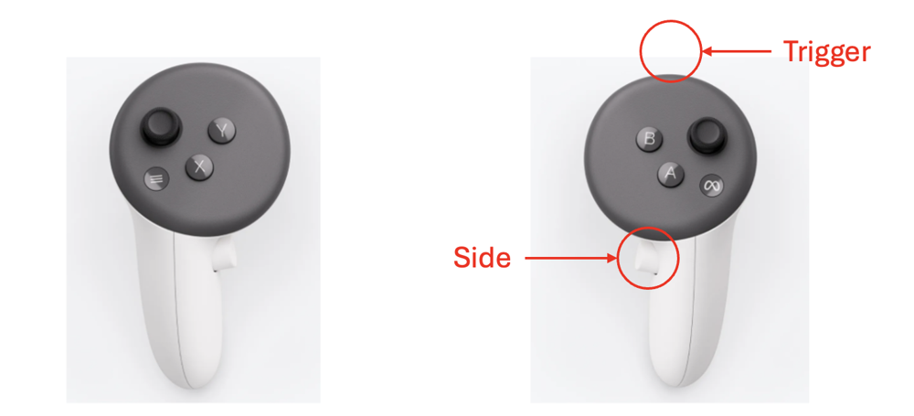

# VLA Pipeline hardware

**Goal:** identify and connect the two-arm station. Each xArm 7 has its own control box, gripper, and stand; both share the [workstation](../../getting-started/hardware.md). Set up rig A first, then rig B.

[Identify the parts in the labeled photograph](../index.md).

## 1. Equipment

Quantities are for the complete two-arm station. Workstation, display, and network equipment are counted once in [shared equipment](../../getting-started/hardware.md#shared-equipment).

| Equipment | Quantity | Product or reference |
|---|---|---|
| UFACTORY xArm 7 robot | 2 | [UFACTORY xArm](https://www.ufactory.cc/xarm-collaborative-robot/) — select xArm 7 |
| Control box with arm cables and mains lead | 2 | [Control box and supplied cables](https://docs.xarm.ufactory.cc/2.hardware_installation.html) |
| xArm gripper with mounting and cable set | 2 | [UFACTORY grippers](https://www.ufactory.cc/solution-pickandplace/) |
| 3D-printed gripper finger | 4 (2 per gripper) | [Finger STL](../assets/xarm-gripper-finger.stl) — lab design, printed in-house |
| Vention arm stand | 2 | [Vention design 506323](https://vention.com/machine-builder/506323) — account with design access required |
| Work table | 1 | [Workbench catalog](https://www.mcmaster.com/products/workbenches/) — size and load rating to specify |
| Meta Quest 3 headset | 2 | [Meta Quest 3](https://www.meta.com/quest/quest-3/) |
| Quest Touch Plus controller | 4 (2 per headset) | [Touch Plus controllers](https://www.meta.com/quest/accessories/quest-touch-plus-controller/) — usually bundled with the headset |
| AA batteries for the controllers | 1 pack | [AA alkaline, 20-pack](https://www.amazon.com/dp/B00NTCH52W) — one per controller plus spares |
| Headset USB data cable | 1 per headset | [Meta Link cable](https://www.meta.com/quest/accessories/link-cable/) or an equivalent data-capable cable |
| RealSense D405 wrist camera with USB cable | 2 | [D405](https://www.realsenseai.com/product-family/d405-series/) · [USB cable catalog](https://www.startech.com/en-us/cables/usb-30) |
| xArm wrist-camera mount | 2 (1 per D405) | [UFACTORY camera stand](https://www.ufactory.us/product/ufactory-xarm-camera-stand) — includes mounting plate and 2 m USB-C cable |
| RealSense D435 scene camera with USB cable | 3 | [D435](https://www.realsenseai.com/products/stereo-depth-camera-d435/) · [USB cable catalog](https://www.startech.com/en-us/cables/usb-30) |
| Articulated scene-camera stand | 3 | Model to record — see [open items](../../getting-started/sources.md#open-items) |
| Scene-camera ball-head clamp and thread adapters | 3 clamps, 1 adapter set | [CAMVATE C-clamp](https://www.amazon.com/dp/B0BYDH27WQ) · [CAMVATE 1/4"–3/8" adapter set](https://www.amazon.com/dp/B0DQNP61JC) |
| Ethernet cable, control box to switch | 2 | [Ethernet cable catalog](https://www.startech.com/en-us/cables/network) |
| Task tub and task objects | 4 tubs, 1 task set | [Rubbermaid 7-gallon utility box](https://www.amazon.com/dp/B000BC5EP8) — task objects chosen by the project owner |
| Cable labels, zip ties, and lighting | As needed | [Labels](https://www.mcmaster.com/products/labels/) · [zip ties](https://www.amazon.com/dp/B08TVLYB3Q) · [work lights](https://www.mcmaster.com/products/work-lights/) |

A first session can run with one headset and its two controllers driving both arms; the full station supports two operators.

### Notes on selection

- **Arms and control boxes:** confirm the power supplies, mains leads, and arm cables against [UFACTORY's installation guide](https://docs.xarm.ufactory.cc/2.hardware_installation.html).
- **Stands:** the [Vention design](https://vention.com/machine-builder/506323) opens a sign-in page; ask the owner for access. Mount the arm bases per [UFACTORY's base-mounting requirements](https://docs.xarm.ufactory.cc/2.hardware_installation.html).
- **Gripper fingers:** print two per gripper from the [STL](../assets/xarm-gripper-finger.stl). The part is about 17 × 25 × 62 mm and fits a standard desktop printer bed. Agree material, infill, and orientation with the owner and check the fit before the first session.
- **Wrist cameras:** the [UFACTORY camera stand](https://www.ufactory.us/product/ufactory-xarm-camera-stand) is listed for the D435 but fits the D405; its 2 m USB-C cable covers the wrist camera, so do not order a second cable.
- **Scene cameras:** each D435 sits in a small ball-head clamp with a 1/4"–3/8" adapter on an articulated stand clamped or bolted to the table. Position the three stands outside the arms' reach.
- **Headsets:** keep chargers, spare AA batteries, and data-capable USB cables long enough for the operator with the station kit.

## 2. Connection map

**Workstation** · RTX PRO 6000

**Ethernet → shared switch/router**

- Control box A → supplied arm cables → xArm A
- Control box B → supplied arm cables → xArm B

**USB → workstation**

- 2 × D405 wrist cameras
- 3 × D435 scene cameras
- Each headset in use

The map shows data connections. Each control box also has a mains lead; connect power and arm cables per [UFACTORY's instructions](https://docs.xarm.ufactory.cc/2.hardware_installation.html), with external AC disconnected while plugging arm cables. Ask the network administrator to place both control boxes and the workstation on the same network.

## 3. Assemble and connect

1. **Mount:** bolt each arm base to its stand and each gripper to its arm with the approved fasteners. Fit the printed fingers. Check the two arms' overlapping work area.
2. **Pair and label:** label arms, control boxes, and stop buttons **A** and **B**. Connect each arm's power and communication cables to its own box.
3. **Network:** connect both control boxes and the workstation to the switch/router.
4. **Cameras:** mount one D405 per wrist and the three D435s on their stands. Label both ends of each USB cable with the camera position, then connect them to the workstation.
5. **Headsets:** connect each headset in use with a data-capable USB cable. Keep its two controllers with it.
6. **Inspect:** have the installer check connections and cable clearance before power-on. Photograph the ports and labels for the setup notes.

<figure class="handbook-figure" markdown="1">

<figcaption markdown="1">

Left controller: **X/Y** buttons. Right controller: **A/B** buttons, **trigger** (front), and **grip** (side). The red callouts mark the trigger and grip positions.

[View full-size image](../assets/quest_controllers.png)
{ .figure-links }

</figcaption>

</figure>

## 4. Record identities

Keep separate records for rig A and rig B. Rig labels describe a device's role; its serial identifies the physical unit. Do not infer rig identity from left/right position in a photograph, and keep network addresses in the private setup notes.

| Item | What to record |
|---|---|
| Arm and control box | Model, serial, network address, and matching stop button |
| Headset and controllers | Device identities and arm assignment |
| Wrist cameras | Serial and assigned arm |
| Scene cameras | Serial, stand position, and intended view |
| Network | Cable labels and assigned addresses |

Ask the operator to demonstrate stopping, restoring power, and returning to the home position for each rig before any two-arm session. The lab's home angles must be checked against the actual mounting before the first reset.

**Next:** [Hardware readiness](../readiness.md)
