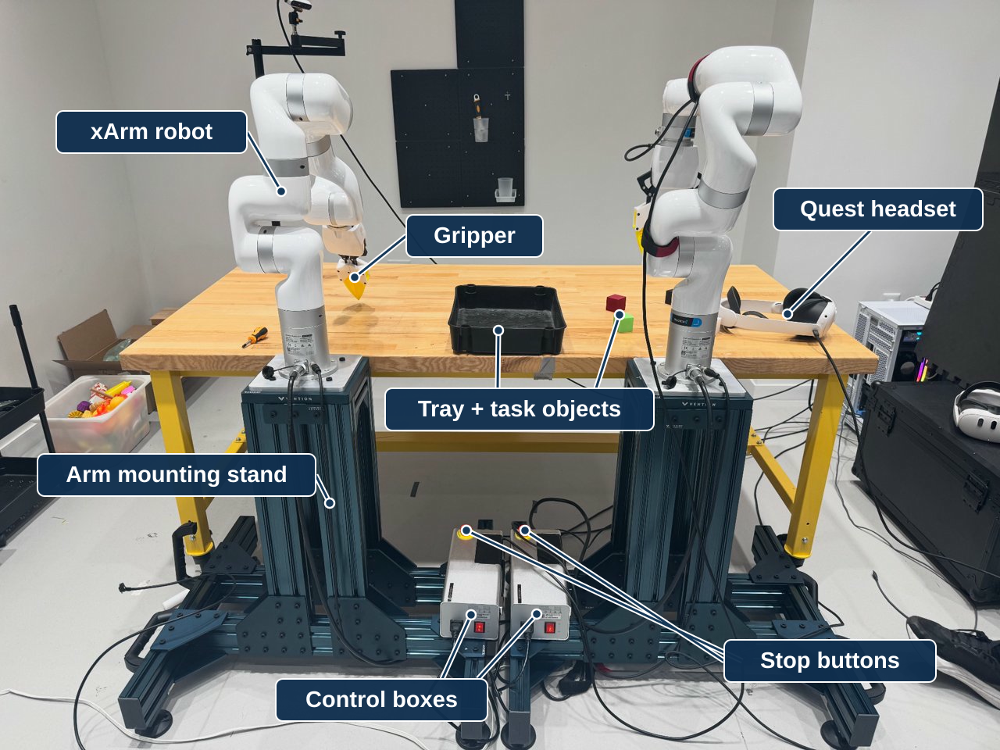

# VLA Pipeline

VLA Pipeline uses **two xArm 7 robots** with grippers, cameras, and Quest headsets. VLA means **vision-language-action**: a model uses images and a task description to predict robot actions.

**Your first goal:** guide rig A through a headset and save one demonstration, then repeat for rig B. Validate each rig before using both together or running a trained model.

A person moving the arm through the headset is called **teleoperation**. A model choosing movements is called **inference**. They use different programs and should not control the same arm at the same time.

<figure class="handbook-figure" markdown="1">

<figcaption markdown="1">

VLA Pipeline lab station with two xArm 7 robots. Validate each rig separately before using both together.

[View full-size image](assets/system_overview-labeled.svg) · [Source photograph](assets/system_overview.jpg)
{ .figure-links }

</figcaption>

</figure>

## Setup guide

First complete [Before you begin](../getting-started/index.md) and [computer preparation](../getting-started/computer.md).

| Step | Guide | You are finished when… |
|---|---|---|
| 1 | [Hardware and connections](hardware/index.md) | The arm is mounted, devices are connected, and identities are recorded |
| 2 | [Install the software](install.md) | The recording tools and arm plugins load successfully |
| 3 | [Configure and start](teleop/setup.md) | The arm, headset, and camera views are ready |
| 4 | [Record a demonstration](teleop/operation.md) | One short episode has been saved |
| 5 | [Run a trained model](inference/index.md) | A saved-data check passes review, then a supervised trial is possible |

[Dataset preparation](teleop/datasets.md) and [model handoff](training/index.md) are useful after the first recording. Training a new model is not required to set up the platform.

Use the [shared RTX PRO 6000 workstation](../getting-started/hardware.md) for this project and Self Improvement Learning. The [arm hardware list](hardware/index.md) covers this project's equipment separately.

## Know the three folders

| Folder on your new workstation | Purpose |
|---|---|
| `<RECORDING_DIR>/` | Lab recording workspace, launch scripts, custom arm/headset/camera plugins |
| `<INFERENCE_DIR>/` | Lab inference script and its settings |
| `<INFERENCE_DIR>/openpi/` | The model server, with its own Python environment |

These placeholders stand for the folders you choose in the [folder guide](../getting-started/paths.md); the internal source layout stays the same. `<INFERENCE_DIR>` itself is **not a Git repository** in the inspected installation. Follow the [source handoff](../getting-started/sources.md) rather than guessing a clone URL.
