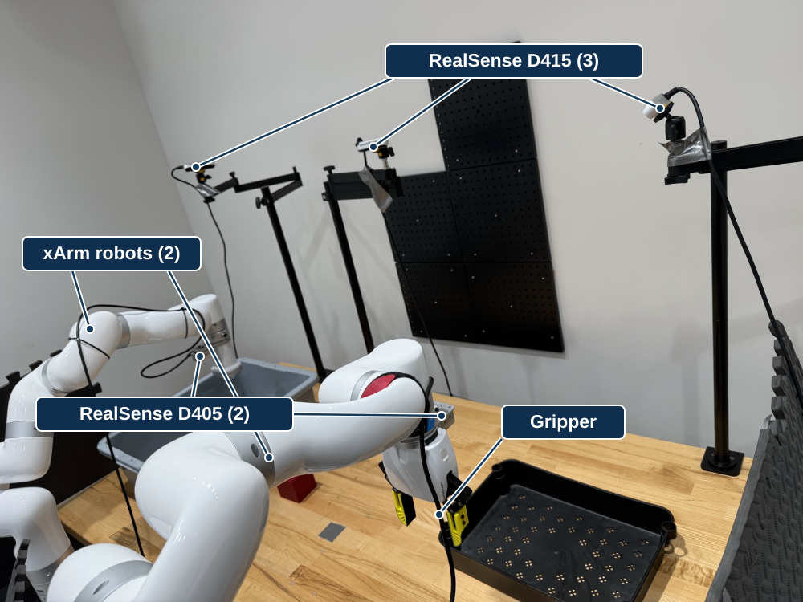

# VLA Pipeline

A tabletop station with **two [xArm 7 robots](https://www.ufactory.cc/xarm-collaborative-robot/)** on Vention aluminum-frame stands, grippers with lab-printed fingers, **two [D405 wrist cameras](https://www.realsenseai.com/product-family/d405-series/)**, **three [D435 scene cameras](https://www.realsenseai.com/products/stereo-depth-camera-d435/)**, and [Quest 3 headsets](https://www.meta.com/quest/quest-3/) for operator control. It uses the [shared workstation](../getting-started/hardware.md).

**Goal:** assemble and identify both rigs, arrange clear camera views, and have an operator check the connections and stop controls.

!!! info "What you need"
    **Core equipment:** 2 xArm 7 robots with control boxes and grippers · 2 Vention stands · 2 D405 wrist cameras · 3 D435 scene cameras · 2 Quest 3 headsets with 4 controllers · work table, tray, and task tubs.

    **Open items:** scene-camera stand model, a connector check on the pending camera cables, and print settings for the gripper fingers. [Details](../getting-started/sources.md#open-items)

<figure class="handbook-figure" markdown="1">

{ loading=lazy width=1000 height=750 }

<figcaption markdown="1">

Both xArm robots · Foreground gripper with printed fingers · RealSense D435 (3) on articulated stands · RealSense D405 (2) at the wrists · Black tray and gray task tub. Labels identify parts, not rig A/B.

[View full-size image](assets/xarm-station-labeled.svg) · [Source photograph](assets/xarm-station.jpg) · [Earlier view with stands and control boxes](assets/system_overview-labeled.svg)
{ .figure-links }

</figcaption>

</figure>

## Set up the platform

| Step | Guide | Ready when |
|---|---|---|
| 1 | [Equipment and connections](hardware/index.md) | Both arms, cameras, and headsets are mounted, connected, and labeled |
| 2 | [Hardware readiness](readiness.md) | The installer has checked the camera views, device identities, and stop controls |

Prepare the [shared workstation](../getting-started/computer.md) first. Check rig A and rig B separately before a two-arm session.
