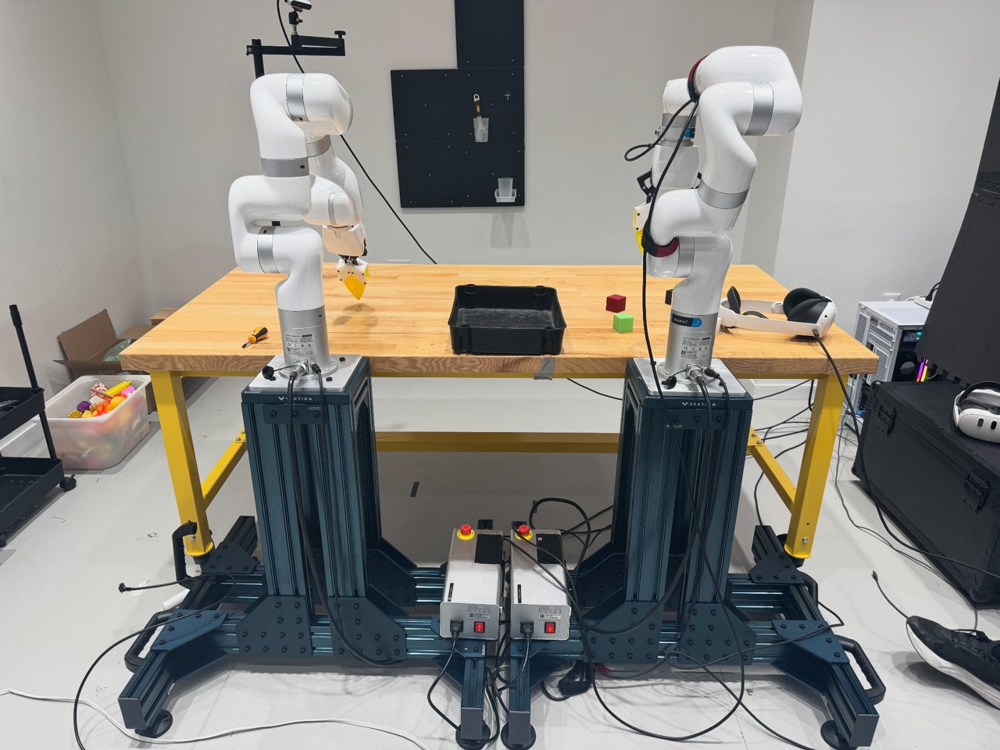

# Teleoperation Overview

Teleoperation lets an operator drive the xArm in VR from the Meta Quest while the motion (and camera views) are recorded as a LeRobot dataset for training.

## The system



- **xArm and its control box.** A left and a right control box drive the left and right arm respectively — this guide focuses on the **right arm**. The round **red button** on the control box is the **E-stop**: push it to lock the arm; lift and turn it clockwise to release.
- **Meta Quest 3.** The goggles plus two handheld controllers are the teleop interface.

## How it works

```
  Quest controllers ──hand pose──▶ xr_teleoperator ──▶ xArm follows (relative motion)
  Quest headset     ◀──camera feeds── camera image server ◀──USB── RealSense cameras
                                          │
                                   lerobot-record  ──▶  episodes saved to datasets/test_<timestamp>/
```

When you press record, your **current hand pose is anchored** to the arm's current pose, and the arm then follows your **relative** hand motion. Each saved demonstration becomes one episode in the dataset.

## Software components

| Component | What it is |
|---|---|
| `lerobot-record` | LeRobot CLI that drives the robot and records episodes |
| `xr_teleoperator` (`--teleop.type`) | Reads Quest controller/headset pose and commands the arm |
| `xarm_robot` (`--robot.type`) | Robot driver for the UFACTORY xArm |
| `imageclient` cameras | Camera frames pulled from the image server (`teleimager-server`) |
| Teleop web server (`:8012`) | Serves the WebXR page the Quest opens to go immersive |

## Read next

1. **[Setup](setup.md)** — start the camera server, connect the Quest, launch a recording session.
2. **[Operation](operation.md)** — the in-headset controls and the per-episode recording workflow (including E-stop recovery).
3. **[Datasets](datasets.md)** — convert, inspect, and merge recorded data for training.
